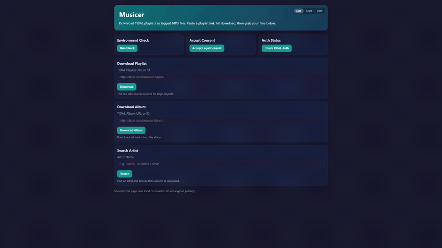
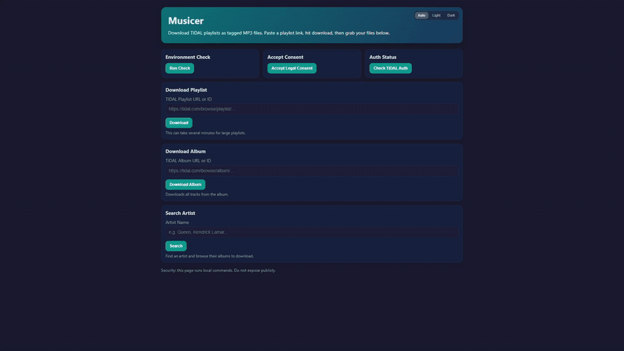

# Musicer

Musicer is a self-hosted web app that downloads music from TIDAL playlists and albums via YouTube as MP3s with full ID3 metadata — cover art, track numbers, disc numbers, year, and album artist embedded. Designed for Jellyfin-compatible local libraries.

## Demo

**Artist search → browse albums → download:**



**Album download with live progress:**



## Legal Notice

This project is intended for personal-use scenarios only.
Using it may violate platform Terms of Service and local laws depending on jurisdiction and content rights.
You are fully responsible for compliance.

## Features

- Download TIDAL playlists and albums as MP3s via yt-dlp + ffmpeg
- Full ID3 metadata: title, artist, album, album artist, track/disc number, year, embedded cover art
- YouTube candidate scoring — picks the best match by title, artist, and duration
- Skip existing files — re-running a download only fetches missing tracks
- Artist search to browse and download albums
- Self-hosted PHP web UI with real-time progress modal (file-based polling)
- Setup wizard, dark mode, library browser, per-album ZIP download
- Jellyfin-compatible output structure: `downloads/<Album Name>/*.mp3`

## Prerequisites

- Node.js 20+
- TIDAL Client ID + Client Secret (or a TIDAL access token)
- [`yt-dlp`](https://github.com/yt-dlp/yt-dlp) installed
- [`ffmpeg`](https://ffmpeg.org/) installed
- XAMPP (Apache + PHP 8) for the web UI

### Linux (CachyOS / Arch)

Install the runtime dependencies with pacman:

```bash
sudo pacman -S yt-dlp ffmpeg
```

The app automatically detects `yt-dlp` and `ffmpeg` from your `PATH` as well as common install locations (`~/.local/bin`, `/usr/local/bin`, `/usr/bin`, `/opt/bin`) — no `.exe` files or `bin/` folder needed on Linux. If you installed via `pipx`/`uv` into a custom location, set `YT_DLP_PATH` / `FFMPEG_PATH` in `.env`.

## Setup

1. Install dependencies:

```bash
npm install
npm run build
```

2. Copy `.env.example` to `.env` and fill in your credentials:

```env
TIDAL_CLIENT_ID=your_client_id
TIDAL_CLIENT_SECRET=your_client_secret
# Optional — only needed if yt-dlp/ffmpeg are NOT on your PATH.
# Linux example:   YT_DLP_PATH=/home/you/.local/bin/yt-dlp
# Windows example: YT_DLP_PATH=C:\ytdlp\yt-dlp.exe
#YT_DLP_PATH=
#FFMPEG_PATH=
OUTPUT_DIR=./downloads
```

TIDAL credentials: use Client ID + Client Secret from the [TIDAL developer portal](https://developer.tidal.com/documentation/api-sdk/api-sdk-authorization). Musicer will handle the OAuth token exchange automatically.

3. Verify everything is configured:

```bash
npm run dev -- check
```

## Web UI (XAMPP)

1. Start Apache via XAMPP.
2. Open `http://localhost/Musicer/` — a setup wizard will guide you through first-run configuration.
3. Use the download forms to start playlist or album downloads with a live progress modal.

> Keep the web UI local-only. It executes shell commands in the project directory.

## CLI Commands

```powershell
npm run dev -- consent          # Accept the legal disclaimer
npm run dev -- check            # Verify yt-dlp, ffmpeg, and TIDAL credentials
npm run dev -- auth             # Test/refresh TIDAL authentication
npm run dev -- download <id>    # Download a TIDAL playlist by ID or URL
npm run dev -- album <id>       # Download a TIDAL album by ID or URL
npm run dev -- artist <query>   # Search TIDAL artists
```

## Running Tests

```powershell
npm test
```

Tests use Node.js's built-in test runner (`node:test`) with `tsx` for TypeScript support. No additional test framework required.
